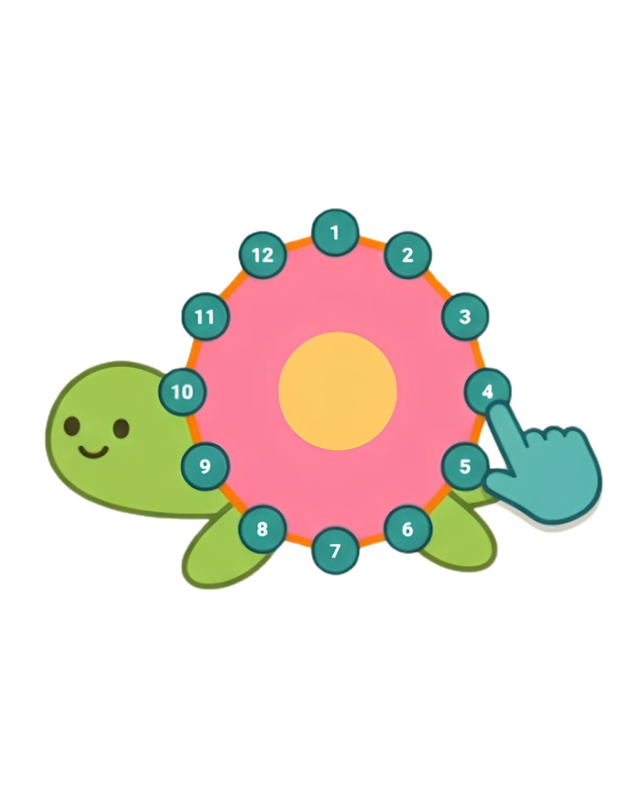
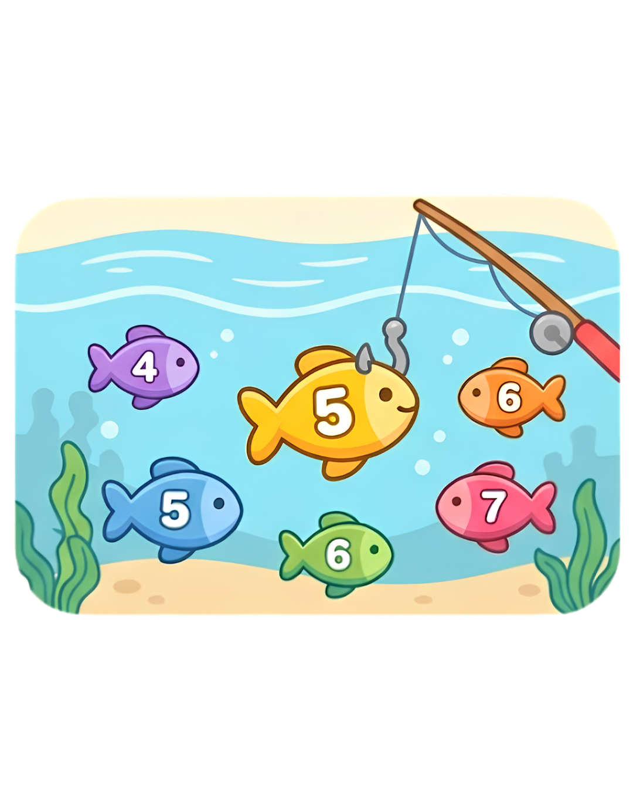
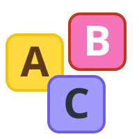

# 🎮 edutech: Suite de Juegos Educativos para Preescolar

¡Bienvenido/a a mi portafolio de recursos educativos digitales! Esta es una colección de **juegos interactivos basados en la web**, diseñados específicamente como estrategia pedagógica para niños en etapa de educación inicial (preescolar).

## 🎯 Propósito del Proyecto
El objetivo principal de estas herramientas es facilitar el **desarrollo de la coordinación óculo-manual** y la **iniciación en el uso del mouse** (o pantallas táctiles). A través del juego, los niños refuerzan habilidades como:

* **Clic y Doble Clic:** Mediante la explosión de burbujas.
* **Arrastrar y Soltar (Drag & Drop):** Con figuras geométricas y letras.
* **Precisión y Seguimiento:** Uniendo puntos y pescando elementos en movimiento.
* **Lógica y Alfabetización:** Reconocimiento de iniciales y formas.

---

## 🚀 Tecnologías Utilizadas
Para garantizar que los juegos sean ligeros, rápidos y accesibles desde cualquier dispositivo (Canaimitas, Tablets, PC), utilicé:

* **HTML5 Canvas:** Para la renderización de gráficos y animaciones fluidas.
* **CSS3:** Diseño responsivo con fuentes amigables (`Quicksand`, `Luckiest Guy`).
* **JavaScript (Vanilla):** Lógica de juegos, detección de colisiones y manejo de eventos.
* **Web Audio API:** Feedback sonoro sintetizado para una experiencia inmersiva sin archivos pesados.

---

## 🕹️ Juegos Incluidos

| Juego | Habilidad Pedagógica | Vista previa |
| :--- | :--- | :---: |
| **Une los puntos** | Seguimiento visual y orden numérico. |  |
| **Atrapa la estrella** | Tiempo de reacción y precisión de clic. |  |
| **Arrastra las figuras** | Reconocimiento de formas y motricidad fina. |  |
| **Pesca los números** | Identificación de símbolos numéricos. |  |
| **Alfabeto Mágico** | Conciencia fonológica y arrastre de precisión. |  |
| **Burbujas Mágicas** | Coordinación motriz y feedback auditivo. |  |

